# [Date Knight](https://dateknight-38b25c76684e.herokuapp.com/)

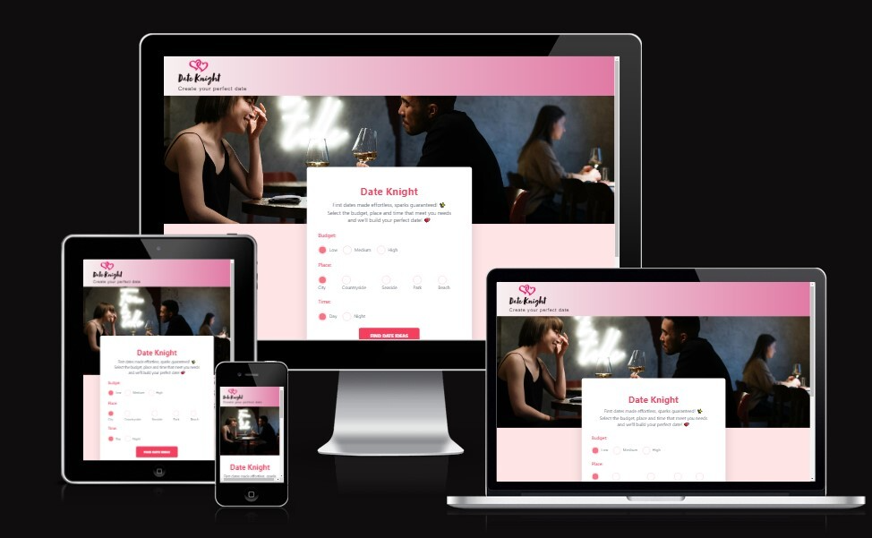

 **The Date Knight *saving* you from your boring dates!**
 
 A responsive web application designed to ignite the spark of romance and inspire unforgettable moments for couples by generating personalised date ideas.

## UX
### Colour Schemes
We have used [coolors.co](https://coolors.co/e11d48-f43f5e-fb7185-fff1f2-ffffff) to generate our colour pallete. The selection of these colors was chosen to encapsulate the essence of Valentine's Day and evoke the emotions associated with a romantic date.

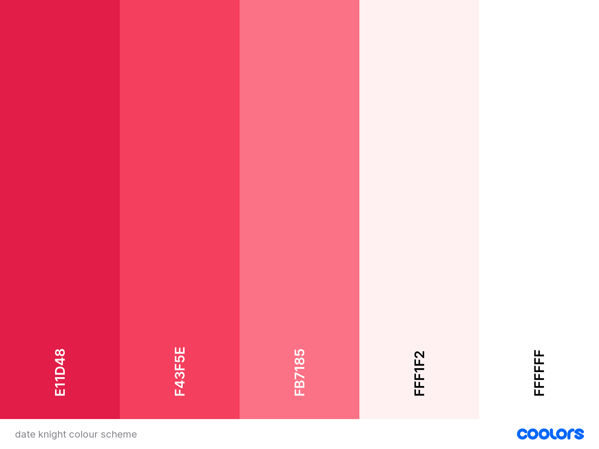

### Typography
We have chosen a sans-serif font to achieve a clean and streamlined appearance, enhancing readability. This choice also imbues a modern and contemporary feel, aligning with our design goals. By prioritizing readability, we aim to enhance accessibility and ensure a more inclusive user experience.

## User Stories

### New User
- As a new user, I would like to be able to view the web application on many devices.
- As a new user, I would like to be able to allocate a budget so I can have a budget-friendly date.
- As a new user, I would like to have options in preferences so it's easier for me to use.
- As a new user, I would like to have an identifiable logo for me to remember the site.

### Frequent User
- As a frequent user, I would like to be able to view social media links so that I can reach out when I need help.
- As a frequent user, I would like to know who the developers are so that I can trust the website more.
- As a frequent user, I would like to get different date ideas for different places.

### Site Administrator
- As a site administrator, I would like to have a distinct and recognizable logo so that it will enhance the brand's visibility.
- As a site administrator, I would like an About Us page to foster trust with users.
- As a site administrator, I would like to have a clear and accessible form for better user convenience.

## Wireframes

To follow best practice, wireframes were developed for mobile, tablet, and desktop sizes.
We have used [Balsamiq](https://balsamiq.com/wireframes) to design the wireframes.

### Mobile Wireframes

 Click here to see the Mobile Wireframes 

Hero Page
  - 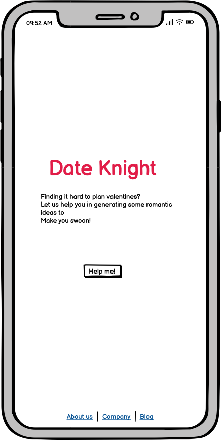

Form Page
  - 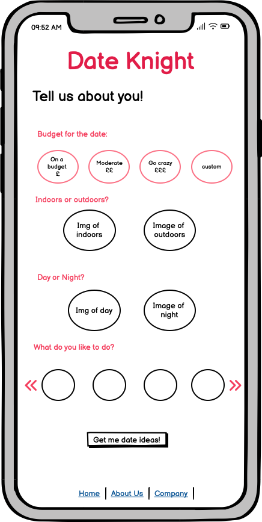

Results Page
  - 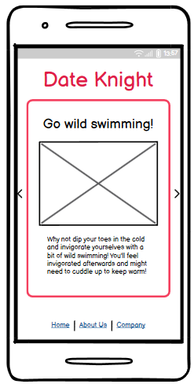

### Tablet Wireframes

 Click here to see the Tablet Wireframes 

Hero Page
  - 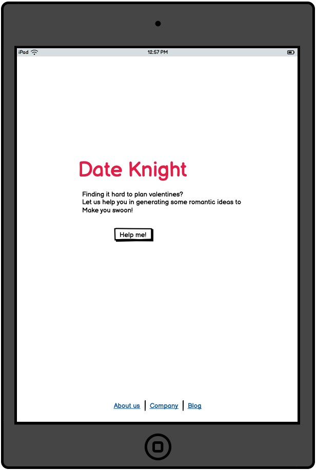

Form Page
  - 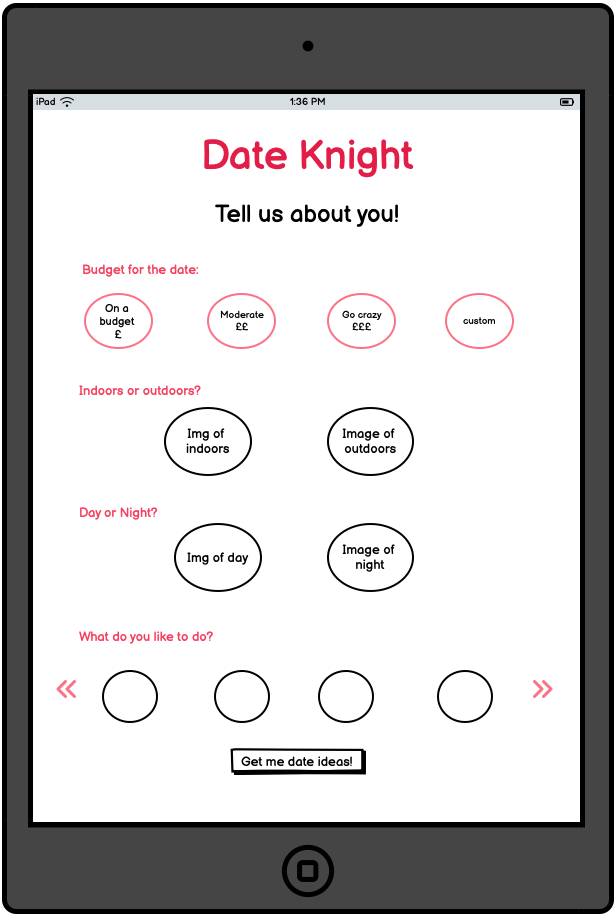

Results page
  - 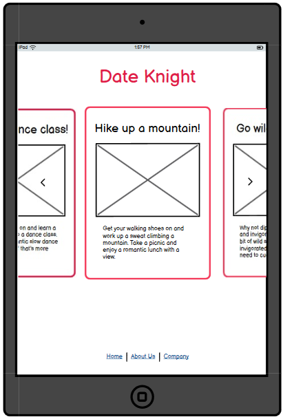

### Desktop Wireframes

 Click here to see the Desktop Wireframes 

Hero Page
  - 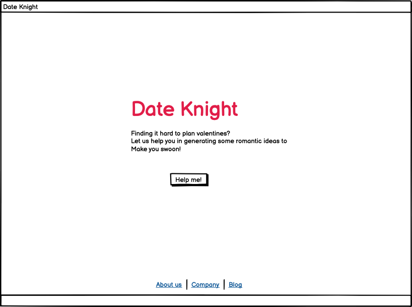

Form Page
  - 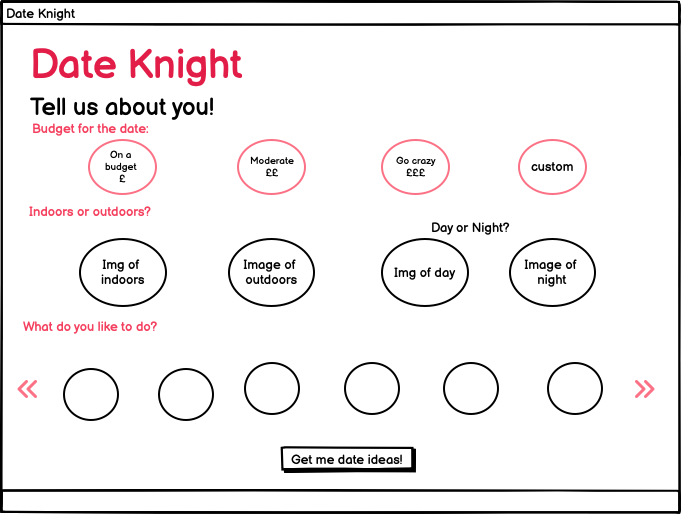

Results Page
  - 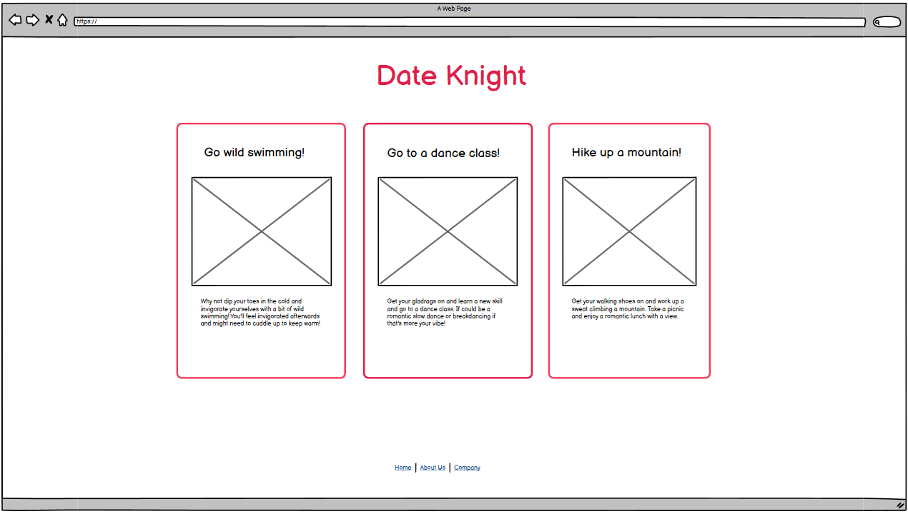

## Data 
We have generated possible date ideas based on user choices:

| Budget | Day/Night | Location    | Date Name                          | Date Description                                                                                                                        |
|--------|----------|------------|-----------------------------------|-------------------------------------------------------------------------------------------------------------------------------------------|
| 1      | Day      | City       | Picnic in the Park                | Pack a homemade lunch or some simple snacks, grab a blanket, and head to a nearby park for a picnic. Enjoy each other's company while soaking up the sunshine and the city skyline.                                                                                             |
|        |          | Countryside| Nature Hike                        | Explore the beauty of the countryside by going on a nature hike. Choose a scenic trail or walking path and spend the day discovering hidden gems such as waterfalls, meadows, or wildlife.                                                               |
|        |          | Beach      | Sandcastle Building                | Channel your inner child and build sandcastles together on the beach. Get creative with your designs, and see who can build the most elaborate castle or sculpture. It's a playful and entertaining way to bond and enjoy the sunshine.                                                               |
|        |          | Park       | Park Yoga Session                 | Bring a couple of yoga mats and enjoy a relaxing yoga session in the park. This is a great way to unwind, get some exercise, and enjoy the beautiful surroundings.                                                                                                               |
|        |          | Park       | Park Bird Watching                | Bring a pair of binoculars and enjoy bird watching in the park. This is a peaceful and relaxing way to spend the day and enjoy nature.                                                                           |
| 1      | Night    | City       | Night Market Exploration          | Visit a local night market or street fair and browse stalls selling handmade crafts, artisanal goods, and delicious street food. Sample tasty snacks, enjoy live music, and soak up the vibrant atmosphere of the city's nightlife.                                               |
|        |          | Countryside| Drive-In Movie Night              | If there's a drive-in theater nearby, consider going for a nostalgic movie night under the stars. Pack some popcorn, blankets, and pillows, and enjoy a double feature from the comfort of your car.                                                                      |
|        |          | Beach      | Beach Bonfire                     | Bring along some firewood and marshmallows for a cozy bonfire on the beach. Enjoy roasting marshmallows, telling stories, and cuddling up under the starlit sky. Just be sure to check if beach bonfires are permitted in your area and follow any safety regulations. |
|        |          | Park       | Stargazing Picnic                 | Bring along a cozy blanket, some homemade snacks, and a thermos of hot cocoa. Find a quiet spot in the park away from city lights, lay out your blanket, and enjoy the beauty of the night sky together. Spend the evening cuddling under the stars, spotting constellations, and sharing stories. |
| 2      | Day      | City       | Café Hopping and Urban Exploration| Spend the day exploring different neighborhoods in the city and hopping between cozy cafes. Enjoy delicious coffee or tea at each stop and take the opportunity to people-watch, chat, and soak in the city's ambiance.                                                                      |
|        |          | Countryside| Explore a Vineyard                | Visit a nearby vineyard in the countryside and go on a wine tasting tour. Sample a variety of wines, learn about the winemaking process, and enjoy the scenic views of vineyards and rolling hills.                                                                            |
|        |          | Beach      | Kayaking or Canoeing              | Rent a kayak or a canoe and explore the coastline together. Paddle along the shoreline, explore hidden coves, and admire the natural beauty of the seaside from a different perspective. Many rental places offer hourly rates, making this an affordable and adventurous date option.    |
|        |          | Park       | Outdoor Games                    | Bring along some fun outdoor games like frisbee, badminton, or a football to play together in the park. It's a great way to stay active and have some friendly competition.                                                                                                      |
| 2      | Night    | City       | Rooftop Bar or Restaurant         | Visit a rooftop bar or restaurant with panoramic views of the city skyline. Enjoy a couple of drinks or appetizers while taking in the breathtaking vistas and soaking up the romantic ambiance of the twinkling city lights.                                                                                                            |
|        |          | Countryside| Country Inn or Bed and Breakfast Stay| Book a cozy room at a charming country inn or bed and breakfast in the countryside for a romantic overnight getaway. Enjoy a peaceful night's sleep in a comfortable and quaint setting, and wake up to a delicious homemade breakfast in the morning.                               |
|        |          | Beach      | Evening Boat Cruise               | Look for a local boat tour or cruise company offering nighttime excursions along the coastline. Embark on a romantic boat ride with your partner, enjoy the sea breeze and stunning views of the shoreline, and create unforgettable memories together on the water.              |
|        |          | Park       | Fire Pit Romance                 | If the park allows it, bring along some firewood and start a small campfire in a designated fire pit area. Roast marsh
 3      | Day       | City       | Fine Dining Experience          | Reserve a table at a Michelin-starred restaurant or renowned gastronomic hotspot for an exquisite fine dining experience. Enjoy a multi-course tasting menu curated by a celebrity chef, complemented by expertly paired wines and impeccable service.                                                       |
|        |           | Countryside| Hot Air Balloon Ride            | Arrange for a private hot air balloon ride over the picturesque countryside with your partner. Enjoy breathtaking views of rolling hills, lush vineyards, and charming villages from high above, accompanied by champagne and gourmet snacks.                                                                       |
|        |           | Beach      | Private Beach Horseback Riding  | Arrange for a private horseback riding excursion along the shoreline with your partner. Ride majestic horses along sandy beaches, through rolling dunes, and along scenic coastal trails for a romantic and unforgettable experience.                                                                                    |
|        |           | park       | Exclusive Horse-Drawn Carriage Ride | Arrange for an exclusive horse-drawn carriage ride through the park. Snuggle up with your date as you glide through the picturesque scenery, enjoying the elegance and romance of a bygone era.                                                                                                               |
| 3       | Night     | City       | Private Cruise on a River or Harbour | Charter a private yacht or luxury boat for a romantic cruise along the city's river or harbor at night. Enjoy champagne, hors d'oeuvres, and breathtaking views of the city skyline and waterfront landmarks from the comfort of your own private vessel.                                                    |
|        |           | Countryside| Luxury Glamping Experience      | Stay in a luxurious glamping tent or private safari lodge in the countryside for a glamorous camping experience under the stars. Enjoy deluxe amenities, gourmet dining, and personalized service in a secluded and serene natural setting.                                                                               |
|        |           | Beach      | Moonlit Sailing Excursion       | Embark on a private sailing excursion under the moonlit sky with your partner. Glide across the water in a luxury sailboat, enjoying the gentle sea breeze and breathtaking views of the moon reflecting off the water                                                                                           |
|        |           | Park       | Fireworks Display and Champagne Toast | Arrange for a private fireworks display in the park to dazzle and impress your date. Toast to your love with champagne as you watch the

## Testing

Our team has thoroughly evaluated the task management and project features through manual examination, testing every button and link to verify their functionality. By utilizing a range of browsers and devices during the testing phase, we ensure the application's dependability and ease of use across diverse platforms.

### Unit tests
Below is a unit test designed to evaluate the models and forms within our Django application.

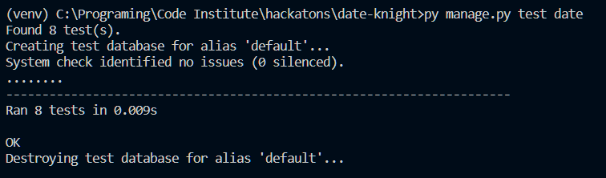

### Code Validation

#### JavaScript Validation

We employed the online tool [JSHint](https://jshint.com/) to validate the JavaScript code of Date-Knight. The code underwent validation seamlessly, without encountering any errors. This affirms that the JavaScript within Date-Knight adheres to recognized coding standards, thereby improving its reliability and performance.

#### HTML Validation

-   [index.html](https://validator.w3.org/nu/?doc=https%3A%2F%2Fdateknight-38b25c76684e.herokuapp.com%2F)

-   [about.html](https://validator.w3.org/nu/?doc=https%3A%2F%2Fdateknight-38b25c76684e.herokuapp.com%2Fabout%2F)

#### CSS Validation

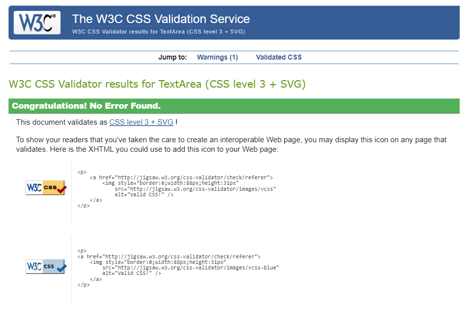

### Responsiveness

Date-Knight underwent extensive responsiveness testing using various software applications and online resources. The majority of the testing was conducted manually, utilizing [Chrome Developer Tools](https://developer.chrome.com/docs/devtools/) with multiple preset device dimensions available in the toolbar.

### Lighthouse testing

#### [Index.html](https://pagespeed.web.dev/analysis/https-dateknight-38b25c76684e-herokuapp-com/4h9tbrra4q?form_factor=desktop)

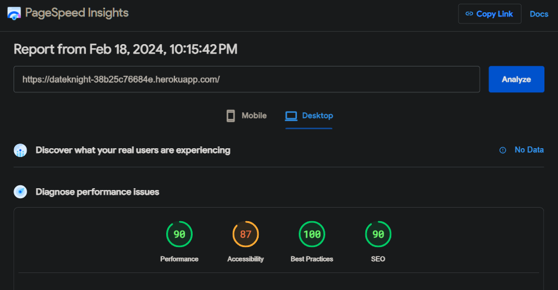

#### [about.html](https://pagespeed.web.dev/analysis/https-dateknight-38b25c76684e-herokuapp-com-about/mkhdlpdoek?form_factor=desktop)

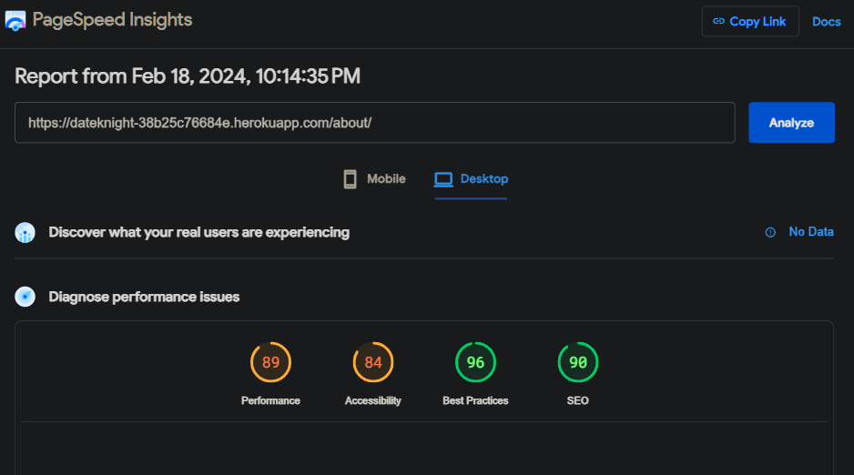

## Tools & Technologies Used
- [HTML](https://en.wikipedia.org/wiki/HTML) used for the main site content.
- [CSS](https://en.wikipedia.org/wiki/CSS) used for the site design and layout.
- [Python](https://www.python.org/) used for the backend.
- [Django-Tailwind](https://django-tailwind.readthedocs.io/en/latest/installation.html) used as a framework for backend and front-end CSS framework for modern responsiveness.
- [Crispy Forms](https://django-crispy-forms.readthedocs.io/en/latest/) used for making the form.
- [JavaScript](https://en.wikipedia.org/wiki/JavaScript) used for interactiveness.
- [JQuery](https://jquery.com/) used as a framework for JavaScript.
- [Jinja](https://jinja.palletsprojects.com/en/3.1.x/) as a template network.
- [Git](https://git-scm.com) used for version control. (`git add`, `git commit`, `git push`)
- [GitHub](https://github.com) used for secure online code storage.
- [Gitpod](https://gitpod.io) used as a cloud-based IDE for development.
- [VScode](https://code.visualstudio.com/) used as a IDE for development.
- [Balsamiq](https://balsamiq.com/wireframes) used to make wireframes.
- [DevTools](https://developer.chrome.com/docs/devtools) used to debug.
- [Heroku](https://www.heroku.com/) used to host deployed site.
- [PostgreSQL](https://www.postgresql.org/docs/15/install-procedure.html) used for online database.
- [Google Sheets](https://docs.google.com/spreadsheets/u/0/create) to draw a table for generated ideas.

## Credit
### Media 
- [Pexels](https://www.pexels.com/photo/man-in-black-long-sleeve-shirt-sitting-on-chair-4255484/) - Hero Image

## Date Knight Contributors

### [Nate](https://www.linkedin.com/in/redsskull/)

Nate loves building projects in Django, React and anything Python or JS and a whole range of projects he is working on. Nate was the natural decision as a scrum master for this project and he has impressed all of us with his wide range of knowledge, and ability to problem solve and root out any problems. He has been the go-to person when any of us need help and has led the way with the backend logic for this project as well as being a quiet supporter of the heart-led design.

### [Dima](https://www.linkedin.com/in/dima-bulavenko-07a162239/)

Dima is a full-stack developer, proficient in using Django and Flask for the backend of his applications, and employing HTML, CSS, and JS for the frontend. He has experience working collaboratively in teams and independently. Dima has been one of the core contributors to the project and quickly came up with a backend design for the project and has been quietly and diligently working on this. He has been readily available to answer questions and help the frontend team with their backend queries whenever it was needed.

### [Jessica](https://www.linkedin.com/in/jessicaakomfrah/)

Jess is a Frontend Developer passionate about creating positive user experiences by developing visually appealing and responsive user interfaces. Experienced in HTML, CSS & JavaScript, she thrives on turning innovative ideas into engaging digital experiences. Jess confidently led the front-end team on this project and created a beautiful love-themed design. Jess’ collaborative approach has made everyone feel welcome and included which helped us form a cohesive group.

### [Amy](https://www.linkedin.com/in/amy-bergstrom-068a26297/)

Amy is a former Maths teacher transitioning to software development. She enjoys the problem-solving and creative aspects of Maths and hopes to apply this love to the field of programming and web applications. Amy is early in this transition but has been able to design and code the team’s “About Us” page as well as being on-hand to contribute to project ideas.

### [Mikaela](https://www.linkedin.com/in/mikaela-virtucio/)

Mika is a nurse transitioning to software development. She has already put her all into this new direction. She loves learning new, difficult things and considers herself “a programmer embracing their cognitive masochism”. Mika combines her two passions by developing projects relating to the medical field.  Mika’s enthusiasm for this project has been clear from the start and she has injected a sense of pace and movement to keep the momentum going. Mika has been on hand to design the look of the website, code the footer and write the readme.

### [Yagavi](www.linkedin.com/in/yagavi-kannadhasan-7538409b)

Yagavi is a dedicated stay-at-home mom who has always harboured a deep passion for coding. She thrives in collaborative environments, making her an excellent team player. With her unwavering determination and newfound skills, she aspires to carve out a successful career in coding, showcasing the perfect blend of maternal warmth and technical prowess. Yagavi was a great team player on this project and injected her style and ideas into this project.

## Acknowledgement 
- We are grateful for Code Institute Hackathon team for facilitating this event and allowing a great team to form.
- We are grateful for our team-mates for sharing their knowledge and expertise, as well as making the time to collobarate and finish the project.
